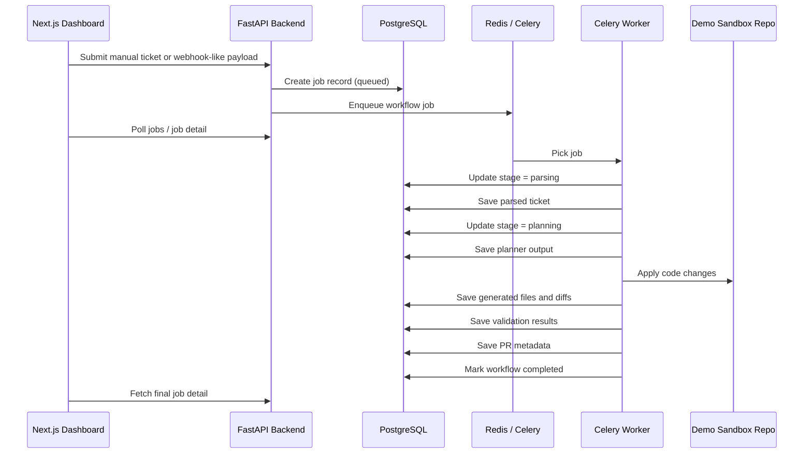

# AI Jira-to-PR Automation Demo

A production-inspired demo project that simulates an **AI-powered Jira-to-PR developer workflow**.

It accepts a Jira-style ticket, parses it into structured fields, creates an implementation plan, applies code changes inside a safe local sandbox repository, runs validation, and produces a draft pull request payload. The frontend dashboard lets you submit tickets, inspect jobs, and review the full workflow output.

---

## What this project demonstrates

- FastAPI backend design
- background job processing with Celery + Redis
- PostgreSQL-backed workflow state tracking
- mock-first AI planning with optional real provider support
- sandboxed code modification flow
- generated PR metadata and validation reporting
- full-stack ownership with a clean Next.js dashboard

---

## Tech stack

### Backend
- FastAPI
- SQLAlchemy
- Alembic
- Celery
- Redis
- PostgreSQL

### Frontend
- Next.js 14
- TypeScript
- React

### Infra
- Docker
- Docker Compose

---

## Architecture overview



---

## Current workflow

1. A Jira-style payload is received through `/api/v1/jira/webhook` or `/api/v1/jira/trigger`.
2. The backend creates a `jobs` record and stores the raw payload.
3. A Celery worker processes the job asynchronously.
4. The Jira parser extracts ticket fields such as summary, description, acceptance criteria, labels, and priority.
5. The planner generates a structured plan.
6. The code-generation service patches files in `demo_repo/`.
7. Validation results are stored.
8. The PR service generates branch, commit, title, and body metadata.
9. The frontend displays job state, generated plan, diffs, validation results, and PR summary.

---

## Folder structure

```text
ai-jira-pr-automation-demo/
├── backend/
│   ├── app/
│   │   ├── api/
│   │   ├── config/
│   │   ├── core/
│   │   ├── db/
│   │   ├── mock_data/
│   │   ├── models/
│   │   ├── prompts/
│   │   ├── repositories/
│   │   ├── schemas/
│   │   ├── services/
│   │   ├── tasks/
│   │   └── tests/
│   ├── alembic/
│   ├── Dockerfile
│   ├── requirements.txt
│   └── entrypoint.sh
├── frontend/
│   ├── src/
│   │   ├── app/
│   │   ├── components/
│   │   └── lib/
│   ├── Dockerfile
│   └── package.json
├── demo_repo/
├── infra/
│   ├── postgres/
│   ├── redis/
│   └── scripts/
├── mock_payloads/
├── docker-compose.yml
├── .env.example
└── README.md
```

---

## Services and ports

| Service | Port | Purpose |
|---|---:|---|
| Frontend | 3000 | Next.js dashboard |
| Backend | 8000 | FastAPI API |
| PostgreSQL | 5432 | workflow persistence |
| Redis | 6379 | Celery broker/result backend |

---

## Environment variables

The project ships with `.env.example`. Copy it to `.env` if you want to override defaults.

Important values:

- `DATABASE_URL`
- `CELERY_BROKER_URL`
- `CELERY_RESULT_BACKEND`
- `LLM_MODE`
- `LLM_PROVIDER`
- `OPENAI_API_KEY`
- `GITHUB_ENABLED`
- `DEMO_REPO_PATH`
- `NEXT_PUBLIC_API_BASE_URL`

### Mock mode vs real mode

**Mock mode** is the default and is the recommended local demo path.

- no external LLM dependency
- deterministic plan output
- deterministic PR output
- works well in interviews and screenshots

**Real mode** can be enabled later by setting:

- `LLM_MODE=real`
- `LLM_PROVIDER=openai`
- `OPENAI_API_KEY=<your-key>`

The current implementation is mock-first and keeps the real provider isolated behind a provider layer.

---

## API endpoints

### Health
```http
GET /api/v1/health
```

### Submit manual ticket
```http
POST /api/v1/jira/trigger
Content-Type: application/json
```

Example request:
```json
{
  "ticket_id": "DEMO-101",
  "summary": "API returns 500 when email is missing; expected 400 validation error",
  "description": "Patch the demo handler so missing email returns a validation response.",
  "acceptance_criteria": [
    "Return 400 when email is missing",
    "Keep successful path unchanged",
    "Update test coverage"
  ],
  "priority": "High",
  "labels": ["bug", "demo", "api"]
}
```

### Submit Jira-style webhook payload
```http
POST /api/v1/jira/webhook
Content-Type: application/json
```

### List jobs
```http
GET /api/v1/jobs
```

### Get job detail
```http
GET /api/v1/jobs/{job_id}
```

---

## Demo scenario

The included sandbox repo contains a simple bug:

```python
email = payload["email"]
```

If `email` is missing, the handler crashes instead of returning a clean validation response.

The automation pipeline updates the handler to use safe access and adds a regression test for the missing-email path.

---

## How to run locally with Docker Compose

### 1. Prepare environment
```bash
cp .env.example .env
```

### 2. Start the full stack
```bash
docker compose up --build
```

### 3. Open the app
- Frontend: `http://localhost:3000`
- Backend docs: `http://localhost:8000/docs`

---

## Local development without Docker

### Backend
```bash
cd backend
python -m venv .venv
source .venv/bin/activate
pip install -r requirements.txt
uvicorn app.main:app --reload
```

### Worker
```bash
cd backend
celery -A app.celery_app.celery_app worker --loglevel=info
```

### Frontend
```bash
cd frontend
npm install
npm run dev
```

You will also need PostgreSQL and Redis running locally.

---

## Tests

Backend test scaffolding is under `backend/app/tests/`.

Run backend tests locally:

```bash
cd backend
pytest app/tests -q
```

The current tests cover:

- Jira parsing
- planner output shape
- PR payload generation
- code generation patch behavior
- API health and manual ticket trigger smoke path

---

## Key implementation choices

- **API and worker are separated** so long-running workflow steps do not block request handling.
- **PostgreSQL stores job state and artifacts** so the UI can reconstruct the full pipeline.
- **Mock mode is default** to keep the project deterministic and portfolio-ready.
- **The sandbox repo is separate** from the app itself so code modifications stay bounded and safe.
- **Status history is persisted** to support timeline-style workflow inspection.

---

## Limitations

- Validation is currently mock-style rather than running a full lint/test subprocess pipeline.
- GitHub PR creation is simulated unless real credentials and provider logic are expanded.
- The real LLM provider path is intentionally minimal because the demo prioritizes reliability.
- Frontend polling is used instead of WebSockets to keep the system simpler.

---

## Future enhancements

- run real lint/test commands inside the sandbox repo
- add retry visibility in the dashboard
- add WebSocket or Server-Sent Events for live updates
- support multi-file planning and multiple ticket scenarios
- support GitHub draft PR creation with richer metadata
- add authentication and user ownership of jobs

---

## Screenshot placeholders

Add your own screenshots here after running the project:

- `docs/screenshots/dashboard-overview.png`
- `docs/screenshots/job-detail.png`

---

## Resume positioning

This project is suitable for showcasing:

- backend systems engineering
- async workflows and queue-based processing
- webhook and API integration patterns
- developer productivity tooling
- safe LLM-assisted automation design
- full-stack execution with clean operational boundaries
